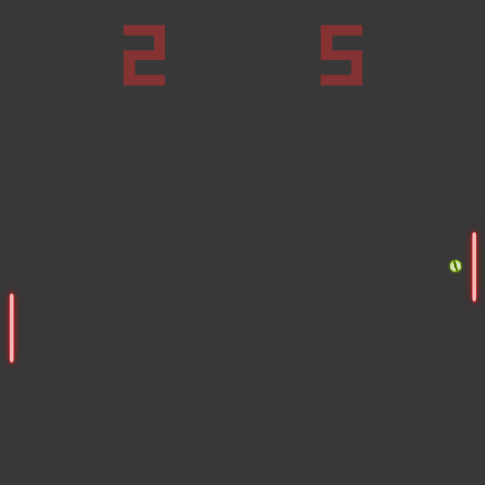

# Amethyst-Pong

A Pong clone written in [Rust](https://rust-lang.org) using the [Amethyst](https://amethyst.rs) game engine.

## Features

- **Single Player Mode**
- **Two Player Mode**
- **Spinning the Ball**

#### Attributions

- Thanks to [Jesús Lastra](https://opengameart.org/users/jalastram) for the [score sound](assets/audio/score.wav) from [here](https://opengameart.org/content/sound-effects-sfx010). [![licensebuttons cc-by][cc-by-3.0-badge]][cc-by-3.0]
- Thanks to [Kenney](https://opengameart.org/users/kenney) for some [UI elements](assets/ui) found [here](https://opengameart.org/content/ui-pack). [![licensebuttons cc0][cc-0-badge]][cc-0]
- Thanks to [OwlishMedia](https://opengameart.org/users/owlishmedia) for [bounce_paddle.wav](assets/audio/bounce_paddle.wav) and [bounce_wall.wav](assets/audio/bounce_wall.wav) found [here](https://opengameart.org/content/8-bit-sound-effect-pack) [![licensebuttons cc0][cc-0-badge]][cc-0]
- Thanks to [DeathsbreedGames](https://deathsbreedgames.github.io/) for [the sprites I modified](assets/texture/sprites.png). *The modified version may be used under the same license as the [original](https://opengameart.org/content/pong-graphics)*. [![licensebuttons by-sa][cc-by-sa-3.0-badge]][cc-by-sa-3.0]
- Thanks to [Computer Music All-stars](https://freemusicarchive.org/music/Computer_Music_All-Stars) for [Albatross v2](assets/audio/Computer_Music_All-Stars_-_Albatross_v2.ogg) and [Where's my Jetpack?!](assets/audio/Computer_Music_All-Stars_-_Wheres_My_Jetpack.ogg) [![licensebuttons by][cc-by-4.0-badge]][cc-by-4.0]
- Thanks to [Alexander](www.orangefreesounds.com/author/alexander/) for the [Roblox Death Sound](assets/audio/Roblox-death-sound.mp3) [![licensebuttons by][cc-by-4.0-badge]][cc-by-4.0]
- Possibly Sheb Wooley for the [Wilhelm Scream](assets/audio/wilhelm.ogx)

[cc-0]: https://creativecommons.org/publicdomain/zero/1.0/
[cc-by-sa-3.0]: https://creativecommons.org/licenses/by-sa/3.0/
[cc-by-3.0]: https://creativecommons.org/licenses/by/3.0/
[cc-by-4.0]: https://creativecommons.org/licenses/by/4.0/
[cc-0-badge]: https://licensebuttons.net/p/zero/1.0/88x31.png
[cc-by-sa-3.0-badge]: https://licensebuttons.net/l/by-sa/3.0/88x31.png
[cc-by-3.0-badge]: https://licensebuttons.net/l/by/3.0/88x31.png
[cc-by-4.0-badge]: https://licensebuttons.net/l/by/4.0/88x31.png
